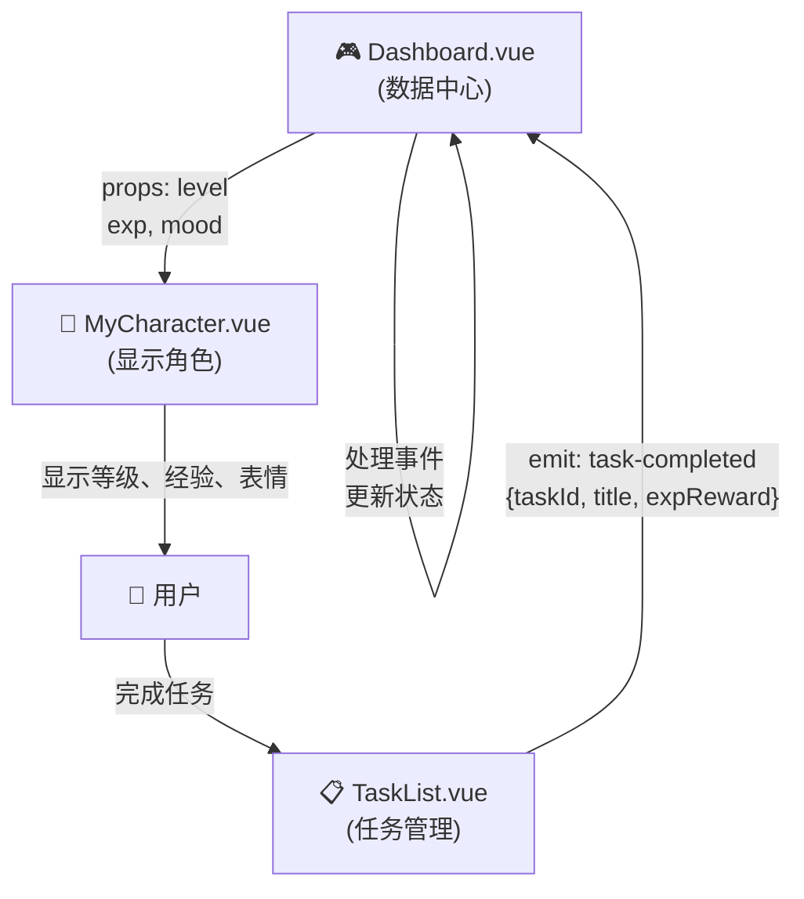

# 🎯 TaskList + MyCharacter 联动 - 完全攻略

## 📊 一、系统架构图



---

## 🔄 二、完整交互流程

### Timeline

```
┌─────────────────────────────────────────────────────────────┐
│ T0: 初始状态                                                │
│ Dashboard: character = { level: 1, exp: 0, mood: 'idle' }  │
│ TaskList: [ ] 完成论文  +10exp                              │
│ MyCharacter: LV 1, 经验条 0%                               │
└─────────────────────────────────────────────────────────────┘
                          ↓
┌─────────────────────────────────────────────────────────────┐
│ T1: 用户勾选任务（点击 checkbox）                           │
│ TaskList 检测 checkbox change                               │
│ emit('task-completed', {                                    │
│   taskId: 1,                                                │
│   title: '完成论文',                                        │
│   expReward: 10                                             │
│ })                                                          │
└─────────────────────────────────────────────────────────────┘
                          ↓
┌─────────────────────────────────────────────────────────────┐
│ T2: Dashboard 接收事件（handleTaskCompleted）              │
│ character.exp += 10  (0 → 10)                               │
│ character.mood = 'happy'                                    │
│ 检查: 10 >= 100? NO → 不升级                                │
│ showCelebration('🎉 完成论文 +10 exp')                      │
└─────────────────────────────────────────────────────────────┘
                          ↓
┌─────────────────────────────────────────────────────────────┐
│ T3: MyCharacter 自动更新                                    │
│ watch() 监听到 props 变化                                   │
│ :exp="10" → 经验条从 0% → 10%                              │
│ :mood="happy" → 表情变笑脸 😊                               │
│ 触发爱心集聚 💖✨ 动画                                       │
└─────────────────────────────────────────────────────────────┘
                          ↓
┌─────────────────────────────────────────────────────────────┐
│ T4: 2秒后自动恢复                                           │
│ character.mood = 'idle'                                     │
│ MyCharacter 表情恢复正常 🌿                                  │
└─────────────────────────────────────────────────────────────┘
                          ↓
┌─────────────────────────────────────────────────────────────┐
│ T5: 用户继续完成任务... ×9 次                               │
│ 累积: exp = 10 → 20 → 30 → ... → 100                       │
│ MyCharacter: 经验条逐步填充 10% → 20% → ... → 100%        │
└─────────────────────────────────────────────────────────────┘
                          ↓
┌─────────────────────────────────────────────────────────────┐
│ T6: 第10次完成任务 - 升级触发 ⭐⭐⭐                        │
│ handleTaskCompleted() 检查:                                 │
│ if (character.exp >= 100)                                   │
│   → character.level = 2                                     │
│   → character.exp = 0                                       │
│   → showCelebration('🎊 升到 LV2！')                        │
└─────────────────────────────────────────────────────────────┘
                          ↓
┌─────────────────────────────────────────────────────────────┐
│ T7: MyCharacter 完整升级动画                                │
│ @level-up 事件触发                                          │
│ 等级徽章: ⭐1 → ⭐2                                        │
│ 彩粒子爆炸✨ × 12                                            │
│ 经验条重置: 100% → 0%                                       │
│ 下一级所需 exp: 100 × 1.2 = 120                             │
└─────────────────────────────────────────────────────────────┘
```

---

## 🎬 三、核心代码解析

### Dashboard.vue - 状态管理中心

```typescript
// 角色状态（集中管理）
const character = reactive({
  level: 1,
  exp: 0,
  mood: 'idle',
})

// 计算下一级所需经验（指数增长）
const nextExpRequired = computed(() => {
  const base = 100        // 第1级需要 100
  const rate = 1.2        // 每级增加 20%
  return Math.round(base * Math.pow(rate, character.level - 1))
  // Lv1: 100, Lv2: 120, Lv3: 144, Lv4: 173...
})

// 经验进度（0-100%）
const expProgress = computed(() => {
  return Math.min(
    Math.round((character.exp / nextExpRequired.value) * 100),
    100
  )
})

// ⭐ 关键函数：任务完成处理
const handleTaskCompleted = ({ taskId, title, expReward }) => {
  // 1️⃣ 增加经验
  character.exp += expReward
  
  // 2️⃣ 改变心情
  character.mood = 'happy'
  
  // 3️⃣ 显示通知
  showCelebration(`🎉 ${title} +${expReward} exp`)
  
  // 4️⃣ 升级检查 ⭐⭐⭐
  if (character.exp >= nextExpRequired.value) {
    const bonus = character.exp - nextExpRequired.value
    character.level++
    character.exp = bonus
    showCelebration(`✨ 升到 LV${character.level}！`)
  }
  
  // 5️⃣ 延时恢复心情
  setTimeout(() => {
    character.mood = 'idle'
  }, 2000)
}
```

### Template 连接

```vue
<!-- 传出 props 给 MyCharacter -->
<MyCharacter
  :level="character.level"      <!-- 当前等级 -->
  :exp="character.exp"          <!-- 当前经验 -->
  :mood="character.mood"        <!-- 当前心情 -->
/>

<!-- 接收事件从 TaskList -->
<TaskList
  @task-completed="handleTaskCompleted"
/>
```

---

## 📊 四、数据结构对照

### Character 状态对象

```typescript
interface Character {
  level: number     // 1-10+
  exp: number       // 0 - (下一级所需 exp)
  mood: string      // 'idle' | 'happy' | 'tired' | 'stressed'
}

// 运行时示例
character = {
  level: 3,
  exp: 42,          // 距离下一级 (144-42 = 102 exp)
  mood: 'happy',
}
```

### Task 事件载荷

```typescript
interface TaskCompletedEvent {
  taskId: number    // 任务 ID
  title: string     // 任务标题
  expReward: number // exp 奖励
}

// 事件示例
{
  taskId: 5,
  title: '完成论文绪论',
  expReward: 15,
}
```

---

## 🎨 五、UI 反馈列表

### MyCharacter 视觉变化

| 事件 | 表情 | 动画 | 持续时间 |
|------|------|------|---------|
| 任务完成 | 笑脸 😊 | 心形爆裂 💖 | 2秒 |
| 升级 | 耀眼 ✨ | 彩粒子爆炸 | 2秒 |
| 闲置 | 正常 🌿 | 轻微摇晃 | 无限 |
| 长期未活动 | 困倦 😴 | 眨眼 | 无限 |

### Dashboard 视觉反馈

| 元素 | 变化 |
|------|------|
| 经验条 | 0% → 100% 平滑填充 |
| 等级数字 | 旧级别 → 新级别 闪烁 |
| 庆祝浮窗 | 从中心弹出，2-3秒后消失 |
| 粒子效果 | 12 个白色粒子向上漂浮 |

---

## 🧮 六、经验系统设计

### 升级公式

```
Lv n → Lv n+1 所需 exp = 100 × 1.2^(n-1)

具体数值:
┌────────┬──────────────────┬───────────────┐
│ 升到   │ 所需经验         │ 累计经验      │
├────────┼──────────────────┼───────────────┤
│ LV 2   │ 100              │ 100           │
│ LV 3   │ 120              │ 220           │
│ LV 4   │ 144              │ 364           │
│ LV 5   │ 173              │ 537           │
│ LV 6   │ 207              │ 744           │
│ LV 7   │ 248              │ 992           │
│ LV 8   │ 298              │ 1290          │
│ LV 9   │ 358              │ 1648          │
│ LV 10  │ 429              │ 2077          │
└────────┴──────────────────┴───────────────┘

从 LV1 到 LV10 需要 2077 exp
平均每个任务 10exp，需要约 208 个任务
```

### 任务 exp 值建议

```typescript
// 难度等级对应的 exp 奖励
const taskExpMap = {
  easy: 5,      // 简单任务
  normal: 10,   // 常规任务（默认）
  hard: 15,     // 困难任务
  epic: 20,     // 史诗级任务
}

// 示例任务
[
  { title: '喝杯水', exp: 5 },
  { title: '完成论文段落', exp: 10 },
  { title: '修复 bug', exp: 15 },
  { title: '论文投稿', exp: 20 },
]
```

---

## 🔍 七、常见坑和解决方案

### 坑1：Props 改不了 MyCharacter

```typescript
❌ 错误做法
<MyCharacter level="1" />  // ← 用字符串

✅ 正确做法
<MyCharacter :level="character.level" />  // ← 用变量
```

### 坑2：事件没有触发

```typescript
❌ 错误做法
const handleTaskCompleted = () => {}  // ← 没有接收参数

✅ 正确做法
const handleTaskCompleted = ({ taskId, title, expReward }) => {}  // ← 解构参数
```

### 坑3：升级不工作

```typescript
❌ 错误：忘记检查条件
// 没有 if (character.exp >= nextExpRequired.value)

✅ 正确：
if (character.exp >= nextExpRequired.value) {
  character.level++
  character.exp = 0  // 或 bonusExp
}
```

### 坑4：心情不变

```typescript
❌ 错误：没有监听 mood prop
// MyCharacter 没有 :mood="character.mood"

✅ 正确：
<MyCharacter :mood="character.mood" />
```

### 坑5：升级了两次

```typescript
❌ 错误：多次导入 handleTaskCompleted
// watch 里又调用了一遍

✅ 正确：确保只在事件处理函数中检查升级
```

---

## 📋 八、检查清单

### 代码准备

- [ ] MyCharacter.vue 已创建 ✅
- [ ] TaskList.vue 已创建 ✅
- [ ] Dashboard.vue 已添加 character state
- [ ] Dashboard.vue 已导入两个组件
- [ ] Dashboard.vue 已添加 handleTaskCompleted
- [ ] Template 已连接 MyCharacter props
- [ ] Template 已连接 TaskList events

### 功能验证

- [ ] 添加任务能显示 ✅
- [ ] 完成任务能 emit 事件 ✅
- [ ] exp 能正确增加 ✅
- [ ] mood 能改为 happy ✅
- [ ] 2 秒后 mood 恢复 ✅
- [ ] exp 满 100 自动升级 ✅
- [ ] 升级显示动画 ✅

### 测试场景

- [ ] **单任务完成**
  - 输入 "测试" → 勾选 → exp +10 → 查看 MyCharacter

- [ ] **连续完成**
  - 完成 10 个任务 → 观察升级

- [ ] **心情变化**
  - 完成任务 → 表情😊 → 2秒后😴

- [ ] **刷新持久化**
  - 完成任务 → 刷新页面 → 验证 exp/level 保存

---

## 🚀 九、部署指南

### 开发模式

```bash
# Terminal 1: Vite 前端
npm run dev:vite
# 访问 http://localhost:5173

# Terminal 2: Electron 桌面 (可选)
npm run dev:electron
```

### 测试步骤

1. **启动应用**
   ```bash
   npm run dev:vite
   ```

2. **打开 Dashboard**
   - 导航到 Dashboard 页面
   - 看到 MyCharacter 在顶部，TaskList 在下方

3. **执行测试**
   ```
   1️⃣ 输入任务 "完成论文" → Enter
   2️⃣ 勾选 checkbox
   3️⃣ 观察 exp 条从 0% → 10%
   4️⃣ 观察表情变😊 + 心形✨
   5️⃣ 等 2 秒，表情恢复
   6️⃣ 重复 10 次，观察升级
   ```

4. **打开浏览器 DevTools**
   - F12 → Console
   - 验证无错误日志
   - 查看 character 状态输出

---

## 📚 十、参考文档

- [INTEGRATION_GUIDE.md](INTEGRATION_GUIDE.md) - 详细集成指南
- [QUICK_INTEGRATION.md](QUICK_INTEGRATION.md) - 快速 3 步集成
- [MyCharacter.GUIDE.md](MyCharacter.GUIDE.md) - 角色组件文档
- [TaskList.GUIDE.md](TaskList.GUIDE.md) - 任务组件文档
- [Dashboard.NEW.vue](Dashboard.NEW.vue) - 完整示例代码

---

## 🎯 总结：3 个关键概念

### 1️⃣ 状态集中管理
```typescript
// Dashboard 管理角色状态
character = { level, exp, mood }
```

### 2️⃣ Props 下传 Emit 上报
```vue
<!-- 下传 props -->
<MyCharacter :level="character.level" />
<!-- 上报事件 -->
<TaskList @task-completed="handleEvent" />
```

### 3️⃣ 事件处理器连接
```typescript
// 处理事件，更新状态，驱动显示更新
handleTaskCompleted = ({ expReward }) => {
  character.exp += expReward
  if (character.exp >= nextExpRequired) {
    character.level++
  }
}
```

---

**现在你已经完全理解了整个系统！** 🎉

选择你的下一步：
- **A. 看代码示例** → 打开 Dashboard.NEW.vue
- **B. 快速集成** → 跟随 QUICK_INTEGRATION.md
- **C. 开始编码** → 修改你的 Dashboard.vue

👉 你想要什么帮助？
